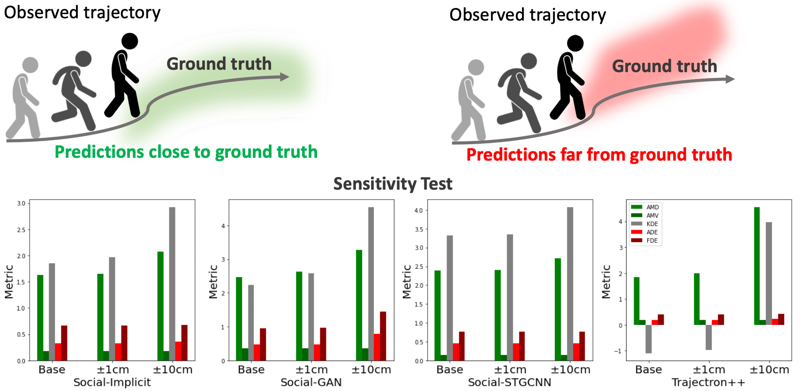
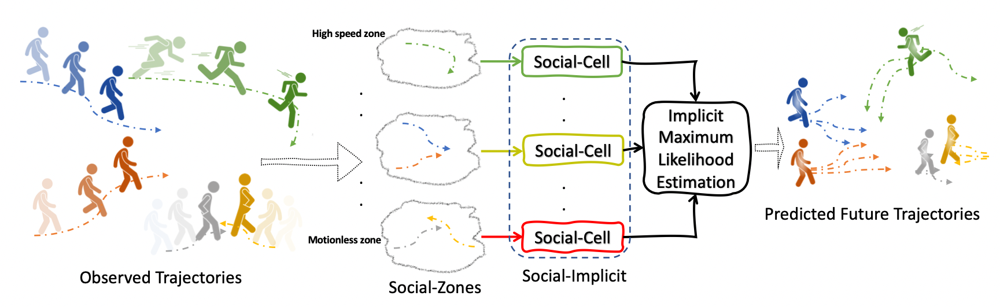
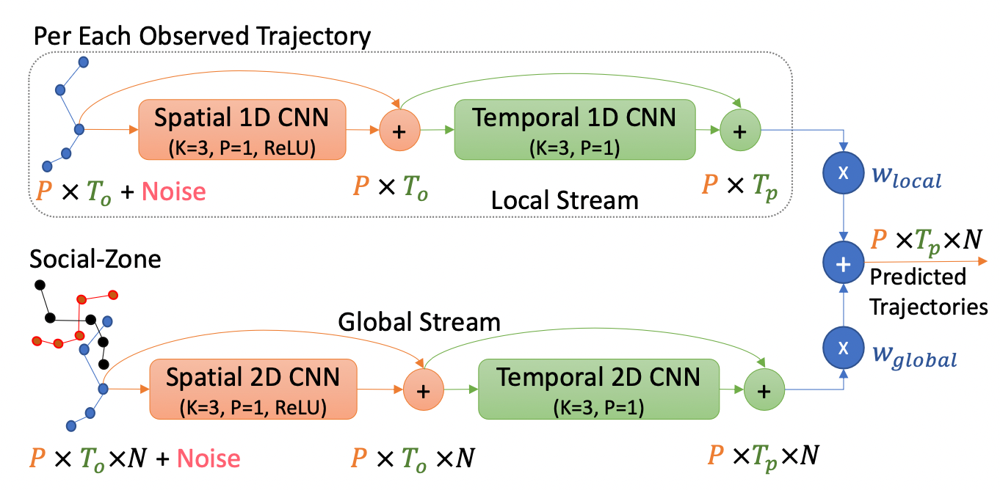
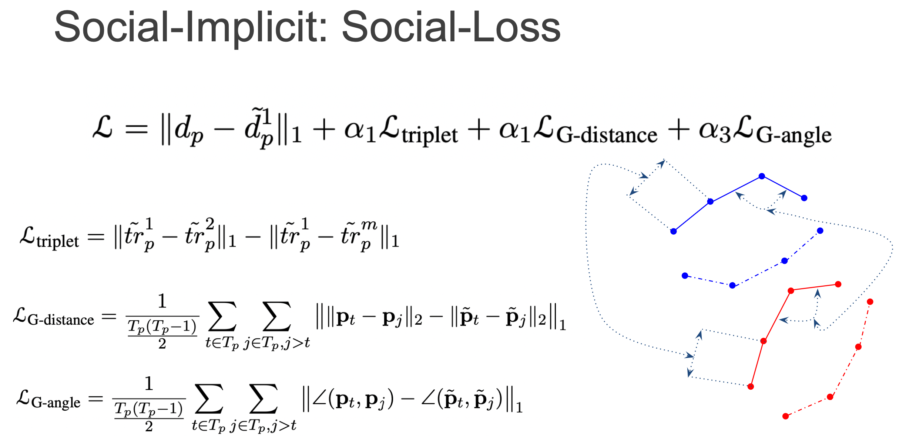

# Social-Implicit: Rethinking Trajectory Prediction Evaluation and The Effectiveness of Implicit Maximum Likelihood Estimation, ECCV2022
### Abduallah Mohamed, Deyao Zhu, Warren Vu <br />
### Mohamed Elhoseiny* , Christian Claudel*
##### <sup>**</sup> Equal advising
### Read full paper <a href="https://arxiv.org/abs/2203.03057">here</a>, Check the interactive demo <a href="https://www.abduallahmohamed.com/social-implicit-amdamv-adefde-demo">here</a>.

### Social-Implicit
<div align='center'>
</img>
</div>
<br />
Best-of-N (BoN) Average Displacement Error (ADE)/ Final Displacement Error (FDE) is the most used metric for evaluating trajectory prediction models. Yet, the BoN does not quantify the whole generated samples, resulting in an incomplete view of the model’s prediction quality and performance. We propose a new metric, Average Mahalanobis Distance (AMD) to tackle this issue. AMD is a metric that quantifies how close the whole generated samples are to the ground truth. We also introduce the Average Maximum Eigenvalue (AMV) metric that quantifies the overall spread of the predictions. Our metrics are validated empirically by showing that the ADE/FDE is not sensitive to distribution shifts, giving a biased sense of accuracy, unlike the AMD/AMV metrics. We introduce the usage of Implicit Maximum Likelihood Estimation (IMLE) as a replacement for traditional generative models to train our model, Social-Implicit. IMLE training mechanism aligns with AMD/AMV objective of predicting trajectories that are close to the ground truth with a tight spread. Social-Implicit is a memory efficient deep model with only 5.8K parameters that runs in real time of about 580Hz and achieves competitive results.<br />

<br />

Beside presenting <strong>the new metrics AMD/AMV</strong> which ensures a fair evaluation of the predictions quality, our method uses three key concepts: <strong>Social-Zones, Social-Cell and the Social-Loss </strong>. 
<div align='center'>
</img>
</div>
<br />

<strong>The Social-Zones</strong> categorise observed agents based on their maximum observed speed. Each Social-Zone is processed by a Social-Cell.<br />
<strong>Social-Cell</strong> is a lightweight modular component with two streams global and local that creates a powerful embedding for the observations illustrated below:
<div align='center'>
</img>
</div>
<br />

Finally, the <strong>Social-Loss</strong> forces geometric constraints on the intra-distance between agents and the angles between agents to be close to the ground-truth.
<div align='center'>
</img>
</div>
<br />

# Code Intructions 
- On the first run of testing or training code, the code will save a pickled version of the processed data for faster production in the next time. 

- We used pipreqs to generate the minimum needed dependcies to run the code. The necessary packages are in requirements.txt, you can install it by running:

```
pip3 install -r requirements.txt
```
## Code Structure
- train.py for training the code
- test_amd_amv_kde.py to test the models and report the AMD/AMV/KDE metrics
- test_ade_fde.py to test the models and report the ADE/FDE metrics 
- CFG.py contains model configratuin parameters 
- metrics.py contains ADE/FDE implementation 
- amd_amv_kde.py contains the AMD/AMV/KDE implementation 
- trajectory_augmenter.py contains the augmentations techniques for trajectories 
- utils.py general utils used by the code 
- pkls folder: stores the data pickles 
- datasets folder: contains the ETH/UCY raw data and SDD data from [DAG net](https://github.com/alexmonti19/dagnet/blob/master/datasets/README.md)
- checkpoint folder: contains the trained models

## Testing using pretarined models
### To report the AMD/AMV/KDE 
```
python3 test_amd_amv_kde.py
```
Note that the code will take a while to run becuase the GMM fit version we use is not vecotrized version. 
### To report the ADE/FDE
```
python3 test_ade_fde.py
```

## Training from scratch 
Simply, run: 
```
train.sh
```
## Visualization 
The visualization script compares our model with prior models. 
The visualization data is precomputed and can be downloaded using
```
Visualization/downloadVisualData.sh
```
Then you will need to run the notebook
```
Align.ipynb
```
In order to generate a suitable visualization pkls aligning the raw outputs of the models. Aftewards, 
you can visualize everything using either the zoomed or the aspect ratio constarined visualization notebooks. 
```
Visualize.ipynb
VisualizeZoomed.ipynb
```

